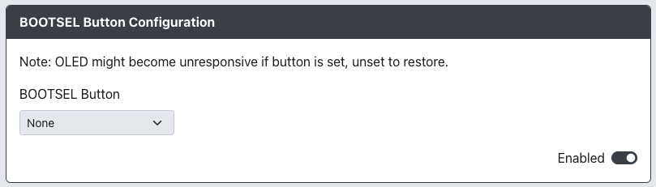

# BOOTSEL Button Configuration

Purpose: This add-on is mean to allow for the use of a BOOTSEL button to be used as an additonal button input as it is generally only when booting into BOOTSEL mode otherwise.

## Web Configurator Options

- `BOOTSEL Button` - Choose an input to be mapped to the BOOTSEL button.

## Hardware

### Requirements

This add-on can only be used on devices that have a BOOTSEL button.

### Installation

There are no installation instructions for this add-on.

## Miscellaneous Notes

The OLED might become unresponsive if this button is set. You can unset it to restore OLED functionality.
