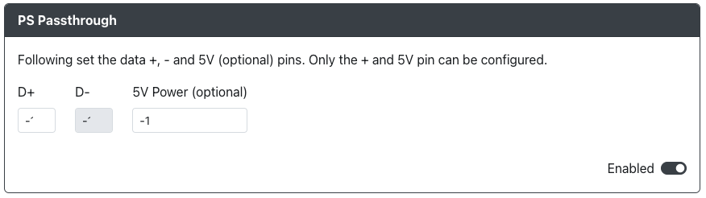

import Tabs from "@theme/Tabs";
import TabItem from "@theme/TabItem";
import PinOption from "./usb-host-add-on/_pin-options.mdx";
import ExampleWiringDiagram from "./usb-host-add-on/_example-wiring-diagram.mdx";

# PS Passthrough

Purpose: This add-on is intended to allow you to use a licensed 3rd party, "categorized" device to authenticate with a Playstation 4 or Playstation 5.

## Web Configurator Options

<PinOption />

:::caution

If you have PS Passthrough enabled, you must turn off the `PS4 Mode` add-on as the two will not work together.

Ensure that under the `Settings` section you have chosen the PS4 for the input mode in order to use the GP2040-CE device as a controller or as a fightstick.

:::

## Hardware

### Requirements

This add-on requires that you have something like the [USB Passthrough Board](https://github.com/OpenStickCommunity/Hardware/tree/main/USB%20Passthrough%20Board) or a board with a USB passthrough port on it already.

### Installation

<Tabs groupId="boards" defaultValue="Raspberry Pi Pico">
<TabItem value="Raspberry Pi Pico" label="Raspberry Pi Pico" default>

<ExampleWiringDiagram />

</TabItem>
<TabItem value="RP2040 Advanced Breakout Board" label="RP2040 Advanced Breakout Board" default>

TODO: Create RP2040 Advanced Breakout Board Instructions for USB Host Port Wiring

Lorem ipsum dolor sit amet, consectetur adipiscing elit. Vestibulum vel consequat tortor, blandit mollis justo. Aenean quis tellus in diam hendrerit vulputate in sed nibh. Sed turpis enim, laoreet eu lorem id, facilisis iaculis sapien. Ut dictum elit sed viverra mattis. Aliquam euismod id ipsum vitae sollicitudin. Vestibulum nisl purus, rhoncus quis est et, ornare sagittis ante. Curabitur pretium felis nec imperdiet pretium. Vivamus mauris elit, consequat quis placerat sit amet, suscipit nec leo. Mauris lacinia nulla ex, vitae suscipit ante ultricies quis. Praesent eu lacus lectus. Donec dapibus odio sit amet ornare consectetur. Duis nec orci nec nulla tempor aliquet.

</TabItem>
</Tabs>

## Miscellaneous Notes

This add-on is not compatible with the [PS4 Mode](./ps-passthrough.mdx) add-on. In order to use one, the other must be disabled.
