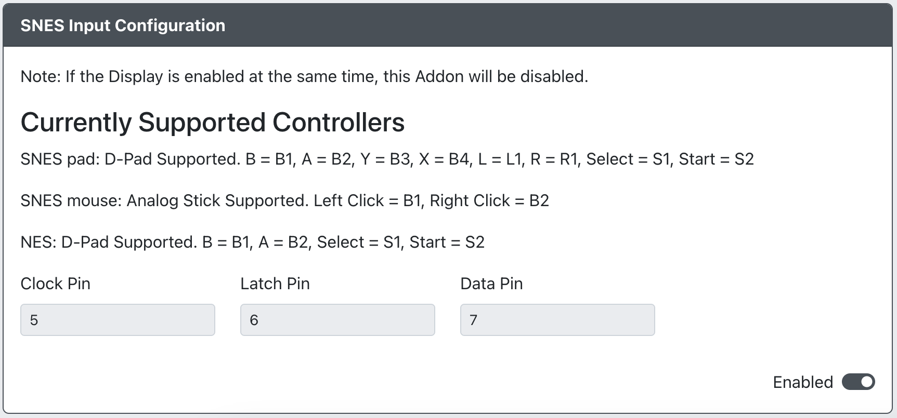

import InputLabelSelector, {
	Hotkey,
} from "@site/src/components/LabelSelector.tsx";

# SNES Input

Purpose: This add-on is intended to allow you to use a GP2040-CE as an adapter to connect an NES controller, SNES controller, or a Super NES Mouse to supported systems.

Select the button labels to be displayed in the usage guide:

<InputLabelSelector />
 

## Web Configurator Options

- `CLOCK Pin` - The GPIO pin used for SNES CLOCK.
- `LATCH Pin` - The GPIO pin used for SNES LATCH.
- `DATA Pin` - The GPIO pin used for SNES DATA.

Supported controller types and their mapping is as follows:

| GP2040                        | NES    | SNES   | Super NES Mouse |
| ----------------------------- | ------ | ------ | --------------- |
| <Hotkey buttons={["Up"]}/>    | Up     | Up     |                 |
| <Hotkey buttons={["Down"]}/>  | Down   | Down   |                 |
| <Hotkey buttons={["Left"]}/>  | Left   | Left   |                 |
| <Hotkey buttons={["Right"]}/> | Right  | Right  |                 |
| <Hotkey buttons={["B1"]}/>    | B      | B      | Left Click      |
| <Hotkey buttons={["B2"]}/>    | A      | A      | Right Click     |
| <Hotkey buttons={["B3"]}/>    |        | Y      |                 |
| <Hotkey buttons={["B4"]}/>    |        | X      |                 |
| <Hotkey buttons={["L1"]}/>    |        | L      |                 |
| <Hotkey buttons={["R1"]}/>    |        | R      |                 |
| <Hotkey buttons={["L2"]}/>    |        |        |                 |
| <Hotkey buttons={["R2"]}/>    |        |        |                 |
| <Hotkey buttons={["S1"]}/>    | Select | Select |                 |
| <Hotkey buttons={["S2"]}/>    | Start  | Start  |                 |
| <Hotkey buttons={["A1"]}/>    |        |        |                 |
| `Analog`                      |        |        | Mouse Movement  |

## Hardware

### Requirements

TODO: List any hardware that is required for the intended functioning of this add-on.

### Installation

TODO: List instructions on how to install the hardware for use with this add-on.

## Miscellaneous Notes

TODO: Provide any miscellaneous notes that an end user may want or need to know with regard to this add-on.
