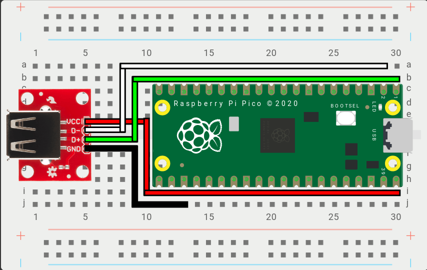

### Example Wiring

- `VCC` - Connects to 5V power (Example: VBUS on the Raspberry Pi Pico)
- `D+` - Connects to the `D+` GPIO Pin above, set in the Web Configurator. (Example: GPIO0 on the Raspberry Pi Pico)
- `D-` - Connects to the `D-` GPIO Pin above, automatically set based on D+. (Example: GPIO1 on the Raspberry Pi Pico)
- `GND` - Connects to a ground pin, any `GND` pin will work. (Example: GND on the Raspberry Pi Pico)

:::note

For `D+` and `D-`, any set of GPIO pins can be used from the RP2040. However, there is a requirement that `D-` GPIO must immediately follow `D+`.

:::
