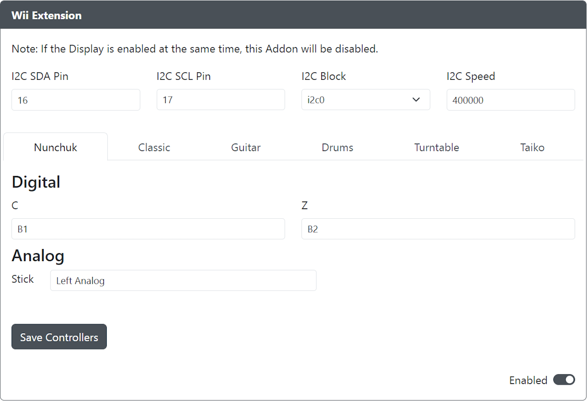

# Wii Extensions

Purpose: The intended function and purpose of this add-on for an end user.

## Web Configurator Options

- `I2C SDA Pin` - The GPIO pin used for Wii Extension SDA.
- `I2C SCL Pin` - The GPIO pin used for Wii Extension SCL.
- `I2C Block` - The block of I2C to use (i2c0 or i2c1).
- `I2C Speed` - Sets the speed of I2C communication. Common values are `100000` for standard, or `400000` for fast.

### Requirements

- Classic Controller support includes Classic, Classic Pro, and NES/SNES Mini Controllers.
- Original Classic Controller L & R triggers are analog sensitive, where Pro triggers are not.

### Installation

TODO: List instructions on how to install the hardware for use with this add-on.

## Miscellaneous Notes

Due to an accessory hardware issue, Drum & DJ turntable controllers may require hot-swapping from a Nunchuk or Classic controller before being usable.
